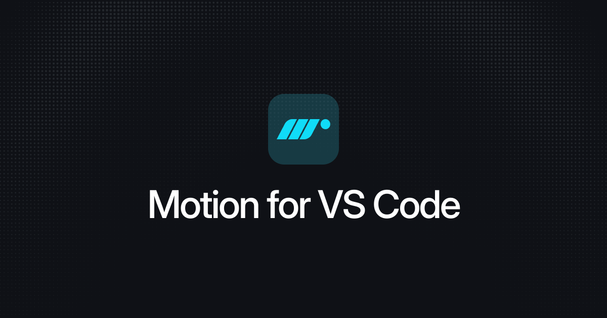

<h1 align="center">
  
</h1>

Supercharge your animation development process with Motion for VS Code.

-   **Copilot docs:** Turn Copilot into a Motion expert with the latest docs.
-   **CSS generation:** Enhance Copilot's CSS generation with real Motion springs.
-   More features coming soon

<!--
Additionally, [Motion+](https://motion.dev/plus) users gain access to:

-   **AI+ docs:** Latest docs for Motion+ features like `Cursor` and `Ticker`
-   **Curve visualisation:** Lets Copilot visually see springs and easing curves
-   **Spring editor:** Edit Motion springs inline, in real-time
-->

## Install

Install via the [VS Code Marketplace](https://marketplace.visualstudio.com/items?itemName=Motion.motion-vscode-extension)

## Features

### Copilot docs

Load the latest Motion documentation directly into Copilot. Add docs to a chat by clicking on "Add Context":


Navigating to "MCP Resources..."


Search for the docs you're looking for:


[Learn more about Copilot docs](https://motion.dev/docs/ai-llm-documentation)

### CSS generation

With Motion for Visual Studio Code , Copilot gains the ability to generate CSS `linear()` easing curves to create springs or other custom easing curves.

> Generate a CSS spring that's quite bouncy

```js
600ms linear(0, 0.0121 /* ... */)
```

[Learn more about CSS generation](https://motion.dev/docs/ai-generate-css-springs-and-easings-llm)

<!--

## Extension Settings

Include if your extension adds any VS Code settings through the `contributes.configuration` extension point.

For example:

This extension contributes the following settings:

-   `myExtension.enable`: Enable/disable this extension.
-   `myExtension.thing`: Set to `blah` to do something.

## Motion+ authentication

To enable Motion+

-->

## Issues & feature requests

Found a bug or have a feature request? Open an issue on the [Motion repo](https://github.com/motiondivision/motion).
